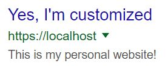
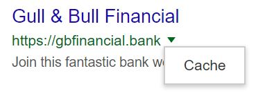
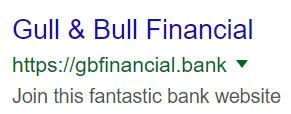
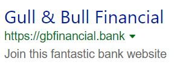
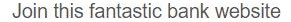
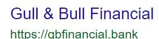
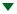

# SEARCH INJECTOR

## Introduction




    
This Google Chrome extension adds a custom search result on google and bing results pages

First this script checks if you searched for a specific term contained in "search_terms" array.
> The accepted search terms and your search term on google/bing are case insensitive

If the search term is present the script stores the element that will contain the search results
and starts to create all the necessary elements to create a final element that is similar
to every other search result.
> "Similar" because tracking codes have been removed, a nice feature would be to random generate them,
> but this might be noticed only if someone carefully inspects the html elements using the devtools

> By default the extension is called "easysurf", to change it go into the manifest.json file and change the "name" value

## Sections
* [Usage](#usage) 
* [Documentation](#documentation-)
    * [Google specific docs](#google-specific-docs)
    * [Bing specific docs](#bing-specific-docs)
* [Archive content](#archive-content-)
* [Changelog](#changelog-)
* [Author](#author-)

## Usage

1. Set these variables:

* search_terms : search terms that trigger the script
* url : URL of the website
* name : name of the website
* details_text : details of the website

    Example:
    ```js
    search_terms = ["gbfinancial", "Gull & Bull Financial", "Gull & Bull"];
    url = "https://gbfinancial.bank";
    name = "Gull & Bull Financial";
    details_text = "Join this fantastic bank website";
    ```
    > Each change needs a reload of the extension from options -> tools -> extensions
    
2. Go to the extensions tab ( ```chrome://extensions/``` ) under options -> tools -> extensions

3. Set developer mode on by changing the switch status on the top right side of the window

4. Click on "load not packaged extension" (top left side of the window) and select the folder of the extension ( in this case "easysurf" )

5. Search on google (or bing) one of the search term that is inside search_terms

    For example search for "gbfinancial", "Gull & Bull Financial" or "Gull & Bull"

6. The extension will Inject the html inside the results page
    > The results element is a div with class "med" and id="res"

    Continuing with the example above the injected html will be:
    ```html
    <div class="g">
        <!--m-->
        <div>
            <div class="rc">
                <div class="r">
                    <a href="https://gbfinancial.bank">
                        <h3 class="LC20lb">Gull & Bull Financial</h3>
                        <br>
                        <div class="TbwUpd">
                            <cite class="iUh30">https://gbfinancial.bank</cite>
                        </div>
                    </a>
                    <span>
                        <div class="action-menu ab_ctl">
                                
                            <a class="GHDvEf ab_button" href="#" id="am-b14" aria-label="Result options"
                            aria-expanded="false" aria-haspopup="true" role="button"
                            jsaction="m.tdd;keydown:m.hbke;keypress:m.mskpe">
                            <span class="mn-dwn-arw">
                                </span>
                            </a>
                                
                            <div class="action-menu-panel ab_dropdown" role="menu" tabindex="-1"
                            jsaction="keydown:m.hdke;mouseover:m.hdhne;mouseout:m.hdhue">
                                <ol>
                                    <li class="action-menu-item ab_dropdownitem" role="menuitem">
                                        <a class="fl"
                                        href="https://webcache.googleusercontent.com/search?q=cache:https://gbfinancial.bank">Cache</a>
                                    </li>
                                </ol>
                            </div>
                        </div>
                    </span>
                </div>
                    
                <div class="s">
                    <div>
                        <span class="st">Join this fantastic bank website</span>
                    </div>
                </div>
            </div>
        </div>
        <!--n-->
    </div>
    ```

    The is the result:

    

    

    On bing the injected html will be:
    ```html
    <li class="b_algo" data-bm="13">
        <h2>
            <a href="https://gbfinancial.bank" h="ID=SERP,5162.1">Gull & Bull Financial</a>
        </h2>
        
        <div class="b_caption">
            <div class="b_attribution" u="3|5054|4964923925791731|ry_wVZor5PrRyTRynaglSLSEyVjd3ICe">
                <cite>https://gbfinancial.bank</cite>
                <a href="#" aria-label="Actions for this site"
                aria-haspopup="true" aria-expanded="false" role="button">
                    <span class="c_tlbxTrg">
                        <span class="c_tlbxTrgIcn sw_ddgn"></span>
                        <span class="c_tlbxH" h="BASE:CACHEDPAGEDEFAULT" k="SERP,5163.1"></span>
                    </span>
                </a>
            </div>
            <p>
                Join this fantastic bank website
            </p>
        </div>
    </li>
    ```

    And this is bings result:

    

7. Clicking on the URL or the websites name should bring you to that website 

    For the example it should go to https://gbfinancial.bank

[Go to the top](#sections)
## Documentation 

1. First this script loops over the "search_terms" array and lowers each search term and puts them inside the "lowercase_searchterms" array 

2. The script calls the get_searchterm() function:
    
        get_searchterm()

    This function uses current URL
    to create an URL object
    from which it collects the q parameter 
    (query / search term)
    and the hostname
    and returns them

3. The search term gets lowered and the results element is stored
4. The script checks if the lowered search term is contained in "lowercase_searchterms" array.
    > This is why accepted search terms and your search term on google are case insensitive
5. If the check is positive, the script uses document.createElement() to create the elements that
   will contain the "search result"
    > Classes are added using \<element>.classList() method

All the anchor elements are created with the anchor() function:

    anchor(t_arg)

This funcion creates an anchor element
using the properties inside t_arg object.
(This permits to use "named params")

The returned anchor element will have:
* href  : url of a website set in t_arg.url (if specified)
* id    : id of element set in t_arg.id  (if specified)
* class : concatenation of classes set in t_arg.classlist array (if specified)

Example:

    Call:
        anchor({url:"https://www.google.it/", id: "a_tag", classlist: ["my", "custom", "classes"]})

    Return:
        <a href="https://www.google.it/" id="a_tag" class="my custom classes"></a>

[Go to the top](#sections)

### Google specific docs

1. These are the first elements that get created

    ```html
    <div class="g">
        <!--m-->
        <div>
            <div class="rc">
                <div class="r">
                </div>
            </div>
        </div>
    </div> 
    ```
2. The script calls website_details() function:

        google_website_details(t_text)

    This function creates the div with the website details that appear under the websites URL
    > t_text is the text that will appear

    The returned div is then put inside div.rc:

    ```html
    <div class="g">
        <!--m-->
        <div>
            <div class="rc">
                <div class="r">
                </div>

                <div class="s">
                    <div>
                        <span class="st">t_text</span>
                    </div>
                </div>
            </div>
        </div>
    </div> 
    ```

    In practise this is the result of the example

    

3. google_anchor() gets then called by the script:

        google_anchor(t_name, t_url)

    Creates anchor tag for a website that
    is called \<t_name> and has url = \<t_url>

    And the returned anchor tag is put inside div.r
    
    ```html
    <div class="g">
        <!--m-->
        <div>
            <div class="rc">
                <div class="r">
                    <a href="t_url">
                        <h3 class="LC20lb">t_name</h3>
                        <br>
                        <div class="TbwUpd">
                            <cite class="iUh30">t_url</cite>
                        </div>
                    </a>
                </div>

                <div class="s">
                    <div>
                        <span class="st">t_text</span>
                    </div>
                </div>
            </div>
        </div>
    </div> 
    ```

    This is how it looks now:

    

4. The script inserts a span element inside the div.r, after the anchor,
   then a div with class="action-menu ab_ctl" is put inside the span

    ```html
    <div class="g">
        <!--m-->
        <div>
            <div class="rc">
                <div class="r">
                    <a href="t_url">
                        <h3 class="LC20lb">t_name</h3>
                        <br>
                        <div class="TbwUpd">
                            <cite class="iUh30">t_url</cite>
                        </div>
                    </a>

                    <span>
                        <div class="action-menu ab_ctl">
                        </div>
                    </span>
                </div>

                <div class="s">
                    <div>
                        <span class="st">t_text</span>
                    </div>
                </div>
            </div>
        </div>
    </div> 
    ```
5. The script calls action_button() function:

        google_action_button()
    
    This function creates the small green arrow anchor/"button" (  ) next to the websites URL.

    The anchor then goes inside div.action-menu.ab_ctl:

    ```html
    <div class="g">
        <!--m-->
        <div>
            <div class="rc">
                <div class="r">
                    <a href="t_url">
                        <h3 class="LC20lb">t_name</h3>
                        <br>
                        <div class="TbwUpd">
                            <cite class="iUh30">t_url</cite>
                        </div>
                    </a>

                    <span>
                        <div class="action-menu ab_ctl">
                            <a class="GHDvEf ab_button" href="#" id="am-b14" aria-label="Result options"
                            aria-expanded="false" aria-haspopup="true" role="button"
                            jsaction="m.tdd;keydown:m.hbke;keypress:m.mskpe">
                                <span class="mn-dwn-arw">
                                </span>
                            </a>

                        </div>
                    </span>
                </div>

                <div class="s">
                    <div>
                        <span class="st">t_text</span>
                    </div>
                </div>
            </div>
        </div>
    </div> 
    ```
6. google_action_dropdown() function gets called and the returned element is put inside div.action-menu.ab_ctl, after      
    a.GHDvEf.ab_button

        google_action_dropdown(t_url)
    This function creates a div element that contains the actions dropdown menu
    that appears when you click on the green arrow button (element created by google_action_button() function )

    Currently the only action visible in the menu is "cache"
        
        google_webcache_action(t_url)
    This function creates a li element that goes inside the action dropdown menu
    created inside the google_action_dropdown() function

    The html now looks like this:
    ```html
    <div class="g">
        <!--m-->
        <div>
            <div class="rc">
                <div class="r">
                    <a href="t_url">
                        <h3 class="LC20lb">t_name</h3>
                        <br>
                        <div class="TbwUpd">
                            <cite class="iUh30">t_url</cite>
                        </div>
                    </a>
                    <span>
                        <div class="action-menu ab_ctl">
                            
                            <a class="GHDvEf ab_button" href="#" id="am-b14" aria-label="Result options"
                            aria-expanded="false" aria-haspopup="true" role="button"
                            jsaction="m.tdd;keydown:m.hbke;keypress:m.mskpe">
                                <span class="mn-dwn-arw">
                                </span>
                            </a>
                            
                            <div class="action-menu-panel ab_dropdown" role="menu" tabindex="-1"
                            jsaction="keydown:m.hdke;mouseover:m.hdhne;mouseout:m.hdhue">
                                <ol>
                                    <li class="action-menu-item ab_dropdownitem" role="menuitem">
                                        <a class="fl"
                                        href="https://webcache.googleusercontent.com/search?q=cache:t_url">Cache</a>
                                    </li>
                                </ol>
                            </div>
                        </div>
                    </span>
                </div>
                
                <div class="s">
                    <div>
                        <span class="st">t_text</span>
                    </div>
                </div>
            </div>
        </div>
    
    </div>
    ```
7. The last thing that gets added to the html is the "\<!--n-->" comment
8. The html is then injected inside the results page

    This is the final result:

    

[Go to the top](#sections)

### Bing specific docs

1. This is the first element that gets created

    ```html
    <li class="b_algo" data-bm="13">
    </li>
    ```

2. bing_anchor() function gets called:

        bing_anchor(t_name, t_url)
    
    Creates h2 tag for a website that
    is called \<t_name> and has url = \<t_url>

    Now the html looks like this:

    ```html
    <li class="b_algo" data-bm="13">
        <h2>
            <a href="t_url" h="ID=SERP,5162.1">t_name</a>
        </h2>
    </li>
    ```

3. The script creates the div that is going to contain details and url / "citation"

    This is the html now:
   ```html
    <li class="b_algo" data-bm="13">
        <h2>
            <a href="t_url" h="ID=SERP,5162.1">t_name</a>
        </h2>

        <div class="b_caption">
        </div>
    </li>
    ```

4. Now bing_citation() function gets called:

        bing_citation(t_url)
    
    Creates div tag with the citation (url under the websites name)

    For the green arrow the function calls another function:

        bing_action_button()

    This function creates the small green arrow button next to the websites URL

    Current html:
    ```html
    <li class="b_algo" data-bm="13">
        <h2>
            <a href="t_url" h="ID=SERP,5162.1">t_name</a>
        </h2>

        <div class="b_caption">
            <div class="b_attribution" u="3|5054|4964923925791731|ry_wVZor5PrRyTRynaglSLSEyVjd3ICe">
                <cite>t_url</cite>
                <a href="#" aria-label="Actions for this site"
                aria-haspopup="true" aria-expanded="false" role="button">
                    <span class="c_tlbxTrg">
                        <span class="c_tlbxTrgIcn sw_ddgn"></span>
                        <span class="c_tlbxH" h="BASE:CACHEDPAGEDEFAULT" k="SERP,5163.1"></span>
                    </span>
                </a>
            </div>
        </div>
    </li>
    ```

5. bing_website_details() function gets called to create the paragraph with websites details

        bing_website_details(t_text)
    
    This function creates the paragraph with the website details that appear under the websites URL

    Final html:
    ```html
    <li class="b_algo" data-bm="13">
        <h2>
            <a href="t_url" h="ID=SERP,5162.1">t_name</a>
        </h2>

        <div class="b_caption">
            <div class="b_attribution" u="3|5054|4964923925791731|ry_wVZor5PrRyTRynaglSLSEyVjd3ICe">
                <cite>t_url</cite>
                <a href="#" aria-label="Actions for this site"
                aria-haspopup="true" aria-expanded="false" role="button">
                    <span class="c_tlbxTrg">
                        <span class="c_tlbxTrgIcn sw_ddgn"></span>
                        <span class="c_tlbxH" h="BASE:CACHEDPAGEDEFAULT" k="SERP,5163.1"></span>
                    </span>
                </a>
            </div>
            
            <p>
		    t_text
            </p>
        </div>
    </li>
    ```

6. The script checks for the bing ad search and injects the html under it

    This is the result:

    

[Go to the top](#sections)

## Archive content 
```
search_injector-master/
├ images/
│   ├ anchor.JPG
│   ├ arrow.JPG
│   ├ bing_result.JPG
│   ├ cache.JPG
│   ├ custom_website.JPG
│   ├ details.JPG
│   └ example_result.JPG
├ bin/
│   └ easysurf/
│      ├ main.js
│      └ manifest.json
└ README.md
```

[Go to the top](#sections)

## Changelog 
**1.1 2019-07-24:** <br>
First commit

[Go to the top](#sections)

## Author 
stwicher ( https://github.com/stwicher )

[Go to the top](#sections)
